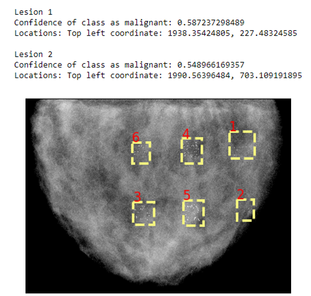

# Modeling Malignant and Benign Microcalcification Clusters
### FDA/DIDSR ORISE Summer Project with Dr. Stephen Glick and Dr. Andrey Makeev

This repository contains the code for simulating microcalcification clusters. The simulated clusters were assessed for malignancy by deep learning CAD algorithm (Faster R-CNN) from Ribli et. al., [Computer aided detection with Faster-RCNN](https://github.com/riblidezso/frcnn_cad). The model used the [py-faster-rcnn model](https://github.com/rbgirshick/py-faster-rcnn). 

Individual calcifications were created using the [raster_geometry](https://github.com/norok2/raster_geometry) library for spherical and cylindrical shapes. Linear clusters were created using the [bresenham](https://github.com/encukou/bresenham) library to find coordinates of a line given two points. All files were created as .RAW file type. 

[Monte-Carlo simulations](https://github.com/DIDSR/VICTRE_MCGPU) were used to generate the final image passed into the model. Specifications: 5e10 photons per simulation, 1 voxel size = 70 μm.

For preprocessing specifications, see the `preprocess` function in `preprocessing.py`. All images used the defaults for preprocessing. Preprocessing code modified from Dr. Kenny Cha's code. 

Images are in [cluster_generation_data repo](https://github.com/marianqian/cluster_generation_data).

## Code
`cluster_generation.ipynb`: A walkthrough of creating clusters, placing clusters, and pre-processing code.

`calc_cluster_generation.py`: File with functions to create calcifications and clusters.

`preprocessing.py`: File with preprocessing and write functions after MC-GPU simulations. 

`calc_cluster_example`: .RAW files of different examples of calcifications and clusters. These clusters were created using the specifications in `cluster_generation.ipynb`.

`phantom`: Zipped files of the Graff breast phantoms with the clusters inserted and the original phantom without any clusters.

`mcgpu_output`: MC-GPU outputs of the phantoms inside `phantom`.

`post_images`: Processed images of the images in `mcgpu_output` using the defaults of the `preprocess` function. 

`software_requirements`: Explanations of how to set-up the software to run the Faster R-CNN model. 

`demo_updated.ipynb`: Modified demo notebook of the Faster R-CNN model from [Computer aided detection with Faster-RCNN repo](https://github.com/riblidezso/frcnn_cad). Outputs the image with malignancy scores and labelilng the bounding boxes. 

**NOTE**: Code here is not located inside Docker containers in `software-requirements/`. Demo notebook will not run if you clone this repository, you would need to either set up the py-faster-rcnn repo from instructions listed [here](https://github.com/rbgirshick/py-faster-rcnn) OR follow instructions in the `software_requirements/` folder to use Docker.

## Background
A common approach for assessing image quality of x-ray breast imaging systems is a task-based evaluation using simulation or experimental phantom studies. One example of using simulations is FDA/DIDSR’s Virtual Imaging Trial for Regulatory Evaluation (VICTRE), which used in silico evaluation of FFDM and DBT and was compared to Siemens clinical trial with real patient data. 

A limitation of the VICTRE study was that the readers of the images were only asked to detect the lesions, while the Siemens clinical trial was a detection task in addition to  estimating the probability of the lesion being malignant. 

## Goal
With the context of the VICTRE study and Siemens clinical trial, our goal is to make in silico trials like the VICTRE study more similar to the Siemens clinical trial by including detection and classification tasks. This requires having both malignant and benign clusters simulated in the studies in order for the reader to classify them. 

For this project, we want to determine how to model these benign and malignant microcalcification clusters by finding which characteristics are specific to malignant clusters. 

Ideally, an expert radiologist would help us determine whether the clusters we simulate are benign or malignant, but since we do not have access to one, we will employ an AI based CAD algorithm to classify the clusters.

## Methods 
1. Insert various models of microcalcification clusters into series of Graff anthropomorphic breast phantoms [4]
2. Run Monte Carlo simulation (MC-GPU) of FFDM modeling Siemens detector
3. Feed simulated FFDM image into CAD algorithm, Ribli et al. [6]

      a. Faster R-CNN, detects & classifies malignant and benign lesions and calcification clusters 
      
      b. Trained on Digital Database for Screening Mammography and INBreast dataset
      
      c. 2nd place in Digital Mammography DREAM Challenge
4. Record malignant likelihood score
5. Observe microcalcification cluster characteristics that suggest malignancy (higher confidence score) 

Image of the model's output, which has bounding boxes and a confidence score for the classification of the cluster being malignant. it gives out all the scores for the clusters detected, but only the top 2 scores are shown here.

## Literature Review
We based off the characteristics we experimented with for the clusters from observations from previous studies that listed some criteria that could possibly incdicate malignancy in a cluster. these include pleomorphism, which is when the individual calcifications vary in size inside the cluster, increasing number and density of calcifications, and changing the cluster shape to a more linear pattern. 

1. Pleomorphism, Park et al. [5]
2. Increasing number of calcifications 

    a. De Lafontan [1]: compact cluster (> 20/cm2) --> malignant lesion, loose clusters (< 10/cm2) --> benign diseases
  
    b. Egan et al. [2]: No cancers were found in clusters with < 5 calcifications in area of 0.5 cm2, 84% of cancers were of clusters > 10 calcifications
  
    c. Franceschi et al [3]., number of calcifications > 15 cm2 

3. Increasing density of calcifications, Park et al. [5]

4. Changing cluster to linear pattern, Franceschi et al. [3]

## Parameters Changed

Parameters experimented with for clusters: 

1. Size of cluster: 5 mm3 , 10 mm3 , 20 mm3

2. Number of calcifications: 10-50 calcifications, increments of 10
3. Location of cluster: Near nipple, near chest wall
4. Cluster shape: Random vs. linear

Parameters experimented with for calcifications: 
1. Size of calcifications: Smaller (3-5 vx3), larger (7-9 vx3), mixed (3-9 vx3)
    
    a. 1 vx3 = 70 μm
    
    b. 3D calcifications (i.e. 3x3x3 vx)

2. Density of calcification: 1.5-2.0 g/cm3, increments of 0.1 (specified in MC-GPU simulation)

## Results and Data
Results and all processed and simulated images are in another GitHub repo, [cluster_generation_data](https://github.com/marianqian/cluster_generation_data). The repo is separated into the different experiments and their results. 

## References
[1] De Lafontan B, Daures JP, Salicru B, et al. Isolated clustered micro-calcifications: diagnostic value of mammography – series of 400 cases with surgical verification. Radiology 1994;190:479–483.

[2] Egan RL, McSweeney MB, Sewell CW. Intramammary calcifications without an associated mass in benign and malignant disease. Radiology 1980;137:1–7.

[3] Franceschi D, Crowe J, Zollinger R, et al. Biopsy of the breast mammographically detected lesions. Surg Gynecol Obstet 1990;171: 449–455.

[4] Graff Christian G. A new, open-source, multi-modality digital breast phantom," Proc. SPIE 9783, Medical Imaging 2016: Physics of Medical Imaging, 978309 (22 March 2016); https://doi.org/10.1117/12.2216312

[5] Park et al. (Clustering of Breast Microcalcifications: Revisited)

[6] Ribli et al. Detecting and classifying lesions in mammograms with Deep Learning. Scientific Reports 2018;8:4165

